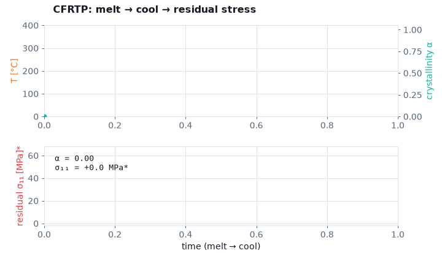

# wccm2026-cfrp-gnn

CFRP段間構造（穴あり）の3次元欠陥推定 — **FEA × Graph Neural Network**。
WCCM 2026 / ECCOMAS（ミュンヘン, 2026-07-22, セッション MS090E）登壇のためのクリーンな作業リポジトリ。

> 既発表（穴あき試験片）: Nishioka et al., *Frontiers in Materials* 12, 1652484 (2025) —
> [DOI:10.3389/fmats.2025.1652484](https://doi.org/10.3389/fmats.2025.1652484)。本研究はこれを**穴あり段間構造＋ノイズ頑健**へ拡張する。

[](https://keisuke58.github.io/wccm2026-cfrp-gnn/)
&nbsp;インタラクティブ可視化（結晶化→残留応力・粘弾性緩和・混合モード剥離前縁）→ **[keisuke58.github.io/wccm2026-cfrp-gnn](https://keisuke58.github.io/wccm2026-cfrp-gnn/)**

## 課題設定（NDT制約）

- 非破壊検査（赤外線応力測定）を想定 → **入力は主応力和 DSPSS と既知形状（座標）のみ**。応力テンソル成分は使用不可。
- 表面DSPSS（最外2層）をグラフのノード特徴とし、**19クラス**（欠陥なし＋層×面内領域）で欠陥位置・挿入層を分類。
- GAT（Graph Attention Network）で不均一応力場を学習。

## 入力正規化の論点（差分 vs plain）

| | 差分正規化（既定） | plain正規化 |
|---|---|---|
| 定義 | (Original − 欠陥なし基準) → z-score | 生DSPSS → z-score |
| 穴の応力集中 | 相殺でき穴周りに強い | 穴集中が支配的で苦手 |
| 実験再現性 | 同一部品の欠陥なし基準が必要（難） | 測定そのままで**基準不要**（実用的） |
| データ | `all_sub_hole_defect_zscore` | 別途生成（`data_prep/`） |

**方針**: 差分を主結果（提出アブスト準拠）に残しつつ、**plain正規化＋幾何特徴(r,θ)で「基準不要化」を拡張**として提示
→ アブストの "future application to experimental infrared stress measurement data" に直結。
切替は `--data_base` と `--extra_geo_features` のフラグのみ（コード改変不要）。

## 構成

```
train.py            # メイン学習（旧 GNN_zscore_sub.py）。DDP/4GPU torchrun
make_mirror_perm.py # 左右ミラー拡張用 permutation を座標から生成
models 相当は train.py 内 GATModel（GAT/GATv2 切替）
Loss/               # Focal ほか損失（train.py が import）
data_prep/          # 正規化スクリプト（差分/plain, percentile zscore 等）
eval/               # 予測・可視化・評価（混同行列, クラス別F1, TDPS）
scripts/            # run_best_configs.sh（既存ベスト）, run_ablation.sh（本研究用）
results/            # 最新の結果図（混同行列・F1）
```

## 精度向上オプション（すべて default-OFF → ベースライン不変）

| フラグ | 内容 | 狙い |
|---|---|---|
| `--conv_type {gatv2,transformer,sage,gin,gine,resgated,pna}` | GAT 以外のアーキへ差し替え（出力次元は不変＝フェア比較） | 表現力・集約多様性 |
| `--conv_type meshgraphnet [--mgn_blocks M]` | Encode-Process-Decode＋エッジ更新（Pfaff 2021）。メッシュ応力場のSOTA構造 | ノード＋エッジ同時更新・長距離伝播 |
| `--edge_geo_features` | 座標差分エッジ特徴 `[dx,dy,dz,dist]` を transformer/pna に供給（gine は常時） | 左右非対称（弱点②）・方向情報 |
| `--extra_geo_features` | 座標由来 r=√(x²+y²), θ を追加（4→6次元） | 穴周り誤推定（基準不要化） |
| `--train_noise_std S` | 学習中DSPSS列にGaussianノイズをオンライン注入 | ノイズ頑健＋過学習抑制 |
| `--train_noise_curriculum` | ノイズ強度を 0→S に線形増加 | 早期崩壊回避 |
| `--label_smoothing E` | CE経路のラベル平滑化（`--no_logit_adjust`時） | 隣接層誤分類 |
| `--mirror_augment --mirror_perm_path P` | 左右反転でtrain倍化 | 左右領域の非対称（論文の弱点②） |
| `--group_purge_eval` | train群と重なるval/testを除外して正直評価 | リーク検査 |

既に本体に実装済み: DropEdge / dropout / residual / minority・class-freqサンプラー /
Focal・LogitAdjust / 層制約 / OneCycleLR。

## 実行（vancouver, 4×RTX4090）

```bash
# 1) ミラーperm を生成（初回のみ）
python make_mirror_perm.py \
  --x /home/nishioka/GNN/GNN_hole/GNN_hole_data/normalized_x_2layer.npy \
  --y /home/nishioka/GNN/GNN_hole/GNN_hole_data/normalized_y_2layer.npy \
  --out mirror_perm.npy

# 2) ベースライン（差分・既存ベスト相当）
torchrun --nproc_per_node=4 train.py --use_onecycle --batch_size 128 --hidden_channels 32

# 3) アブレーション一式（差分/plain × geo ＋ 新規正則化）
bash scripts/run_ablation.sh
```

### データ配置（サーバー側・既定パス）
- 差分zscore: `/home/nishioka/GNN/GNN_hole_2026/all_sub_hole_defect_zscore/{train,val,test}/Defect_L*.npy`
- ラベル: `/home/nishioka/GNN/GNN_hole_2026/all_19class_label/`
- 座標/エッジ: `/home/nishioka/GNN/GNN_hole/GNN_hole_data/normalized_{x,y,z}_2layer.npy`, `hole_edges_2layer_best.npy`
- plain版は `data_prep/` の正規化（差分を経ない）で生成し `--data_base` で指定。

## 現状の数値（参考）
- 事前学習 Macro F1 = **0.730**（val/best, "F10p730"）/ **test ≈ 0.66**（乖離=過学習が課題）
- ノイズ専用データ版は F1 0.17（崩壊）→ 本リポは**オンラインノイズ拡張**で代替。
- Frontiers版（穴あき試験片・差分なし）: Macro F1 0.61, TDPS 0.70。
- 論文の弱点 → 本リポの対策: 隣接層誤分類→`--label_smoothing`、左右非対称→`--mirror_augment`。

## 来歴
Frontiers companion `keisuke58/nishioka_cfrp_gnn` の `GNN_hole_2026/` から、WCCM用に厳選コピーして整理。

## 可視化（CFRTP 工程物理）

物理主役・ML従属の CFRTP 種（残留応力・界面・剥離）を視覚化した副テーマ。定数は例示（`*` 付き）で、**形＝物理の傾向**が主眼。

- **▶ インタラクティブ（GitHub Pages）**: <https://keisuke58.github.io/wccm2026-cfrp-gnn/>
  結晶化→残留応力 / 弾性 vs 粘弾性 / 混合モード剥離前縁 をスライダー操作・再生（テーマ自動）。
- **アニメ GIF**（スライド/論文へ URL 埋め込み可）:
  - 結晶化→残留応力: <https://keisuke58.github.io/wccm2026-cfrp-gnn/cfrtp_crystallization_residual.gif>
  - 弾性 vs 粘弾性（緩和）: <https://keisuke58.github.io/wccm2026-cfrp-gnn/cfrtp_viscoelastic_relaxation.gif>
  - 剥離前縁の進展: <https://keisuke58.github.io/wccm2026-cfrp-gnn/cfrtp_delamination_front.gif>
- ソース: [`viz/`](./viz/)（`gen_viz_anim.py` で再生成）、Abaqus 実装: [`abaqus/`](./abaqus/)。



## 参考文献

CFRTP 工程物理（可視化・Abaqus UMAT）の構成則・パラメータの根拠。**数値はすべて例示（未校正）**で、手法検証は炭素/PEEK の公開データで行う方針。ページ番号など細部は各リンクで要確認。

**残留応力（熱可塑複合材）**
- P.P. Parlevliet, H.E.N. Bersee, A. Beukers, "Residual stresses in thermoplastic composites — A study of the literature. Part I: Formation," *Composites Part A* **37** (2006). <https://www.sciencedirect.com/science/article/abs/pii/S1359835X06000145>
- 同 Part II: Experimental techniques, *Composites Part A* **38** (2007). <https://www.sciencedirect.com/science/article/abs/pii/S1359835X06002223>
- 同 Part III: Effects of thermal residual stresses, *Composites Part A* **38** (2007). <https://www.sciencedirect.com/science/article/abs/pii/S1359835X07000061>

**結晶化カイネティクス（Nakamura / PEEK）**
- K. Nakamura, T. Watanabe, K. Katayama, T. Amano, "Some aspects of nonisothermal crystallization of polymers," *J. Appl. Polym. Sci.* **16** (1972). — Nakamura 非等温式の原典
- J.J. Tierney, J.W. Gillespie Jr., "Crystallization kinetics behavior of PEEK based composites exposed to high heating and cooling rates," *Composites Part A* **35** (2004). <https://www.sciencedirect.com/science/article/abs/pii/S1359835X04000028>
- "Modeling of PEEK Crystallization Kinetics Under Transient Thermal Conditions," *Polymers* (MDPI, open access). <https://www.mdpi.com/2073-4360/18/7/825>

**構成則（工程変形・混合モード界面）**
- A. Johnston, R. Vaziri, A. Poursartip, "A plane strain model for process-induced deformation of laminated composite structures," *J. Composite Materials* **35** (2001). — CHILE（cure-hardening instantaneous linear elastic）
- M.L. Benzeggagh, M. Kenane, "Measurement of mixed-mode delamination fracture toughness … mixed-mode bending apparatus," *Composites Science and Technology* **56** (1996). DOI:[10.1016/0266-3538(96)00005-X](https://doi.org/10.1016/0266-3538(96)00005-X) — B–K 混合モード基準
- P.P. Camanho, C.G. Dávila, M.F. de Moura, "Numerical simulation of mixed-mode progressive delamination in composite materials," *J. Composite Materials* **37** (2003). — 双線形凝集域則

**既発表（本グループ）**
- K. Nishioka et al., *Frontiers in Materials* **12**, 1652484 (2025). DOI:[10.3389/fmats.2025.1652484](https://doi.org/10.3389/fmats.2025.1652484)
