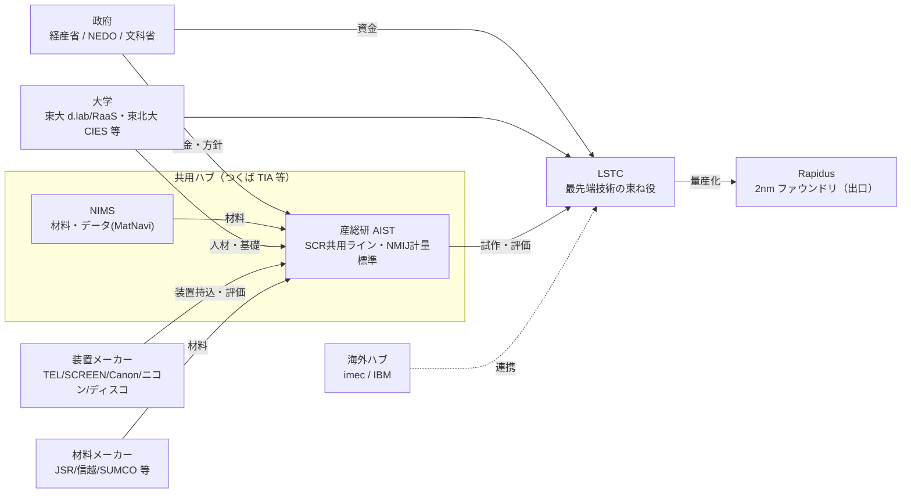

# 半導体の国研エコシステムと運営モデル（imec vs 産総研/LSTC）＋処遇メモ

> 半導体業界と国立研究機関（国研）の関わり方の背景メモ。運営モデル比較・日本のエコシステム相関・
> 処遇（給与）の国際比較を、`SEMICON_PILOT_LINE_GAA_PROCESS.md` / `POST5G_PROJECT_MAP.md` の補足として整理。
> ⚠️ 数値は公開情報＋概算（2026年1月時点の知識）。正確な最新値は各機関の年報・有報で要確認。

---

## 1. 運営モデル比較：imec vs 産総研/TIA vs LSTC/Rapidus

| 項目 | **imec（ベルギー）** | **産総研/TIA（日本）** | **LSTC/Rapidus（日本）** |
|---|---|---|---|
| 性格 | 独立・非営利の先端半導体R&Dセンター（1984〜） | 国立研究開発法人＋連携拠点（TIA） | 技術研究組合(2022)＋量産ファウンドリ(2022) |
| 中核モデル | **IIAP**（Industrial Affiliation Program）：世界の装置・材料・IDM・fabless・ファウンドリが**有料会員**として先端ノードを共同開発 | **共用施設(SCR)＋コンソーシアム＋国プロ**（NEDO 等の実行ハブ） | imec/IBM 連携で **2nm をキャッチアップ**、国研・大学・企業を束ねる |
| 参加形態 | 出資額に応じた**階層的会員**（コア会員ほど先端・早期にアクセス） | 会員制コンソーシアム＋共用施設利用制度 | 組合員（企業）＋国研・大学 |
| 資金 | 予算 **~€8〜9億（~1,200〜1,300億円）/年**。**会費（産業界）主体**、フランドル政府拠出は**~15%程度**、残りは EU/受託 | **運営費交付金（国費）＋受託＋会費**。**国費比率が高い**（年予算 ~1,000億規模） | **国費（経産/NEDO）中心**＋民間。巨額の政府支援 |
| IP | 会員は共同開発 IP にアクセス、各社のバックグラウンド IP は保持。**出資に応じたアクセス階層** | **助成は事業者帰属**、共同研究は契約ごと（成果最大化の知財戦略） | 組合/企業帰属 |
| 規模 | 職員 **~5,500人**、グローバル | 職員 ~2,900人（研究者）、計量標準(NMIJ)も内包 | 新興（設立まもない） |
| 強み | **中立・グローバル・全プレイヤー集結・意思決定が速い** | 中立インフラ・**計量標準・材料**・基礎 | **量産直結**・海外(imec/IBM)連携 |
| 弱み | 自国"産業化"は間接的 | **分散・スピード・処遇**で見劣りしがち | 実績はこれから・巨額国費依存 |

**要点**: imec は「**産業界の会費で回る中立ハブ**」＝政府依存が低く全員が乗る。日本は歴史的に**国費主導・分散**で、LSTC/Rapidus は"束ねて imec に対抗し量産に繋ぐ"新しい試み。

## 2. 日本の半導体 国研エコシステム相関

＝「**基礎・材料(NIMS)→共用試作・評価(AIST/TIA)→束ね(LSTC)→量産(Rapidus)**」のバケツリレーを、装置・材料メーカーと大学が横から支える構図。政府(経産/NEDO/文科)が資金と方針。

## 3. 処遇（給与）の国際比較 — 「海外の国研は高い？」

**傾向としては Yes（特に米国）。ただし国研 vs 民間の差はどこでも大きい。**

| 区分 | 概観（概算・税前・現地通貨換算） |
|---|---|
| 日本 国研（AIST/NIMS） | 公務員準拠テーブルで**抑えめ**。トップ（理事長）**~2,500万円**、上級研究者 ~1,000〜1,500万。 |
| 米 国研/大学（NSTC・DOE labs 等） | シニア/主任級で **$150k〜300k+（~2,300万〜4,500万円+）**。スター級・産業界はさらに上。 |
| 欧 imec/Leti/Fraunhofer | 欧州テック水準で**市場競争力ある額**（ただし高税率）。米ほど極端でない。 |
| 台 ITRI / 韓 研究所 | 基本給は中庸だが、**TSMC 等企業のボーナスが突出**（国研より企業が高い）。 |

- **国研 vs 民間の差**はどの国でも大きく、特に米国は**国研・大学が GAFA/半導体大手と人材を取り合う**ため待遇圧力が強い＝結果として高め。
- 日本の国研は**円安・給与テーブルの上限**もあり、国際比較で見劣りしやすい。だから政策で**クロスアポイントメント／卓越研究員／Rapidus の民間水準給与**など、処遇改善の仕掛けが導入されている。
- ⚠️ 為替・物価・税・役職定義が国ごとに違うので、単純比較は注意。正確値は各機関の給与規程・求人・有報で要確認。

## 4. 我々の研究との接続
TCAD サロゲート（弱形式FE演算子学習）は**競争前(pre-competitive)で共有しやすい"設計・解析の共通基盤"**。imec/AIST 型の共用ハブに載せやすく、「共用解析基盤に効く」というポジショニングが取れる（前工程 GAA＝①③④⑤⑩⑪⑫、後工程 3D/TSV＝⑥⑦）。
