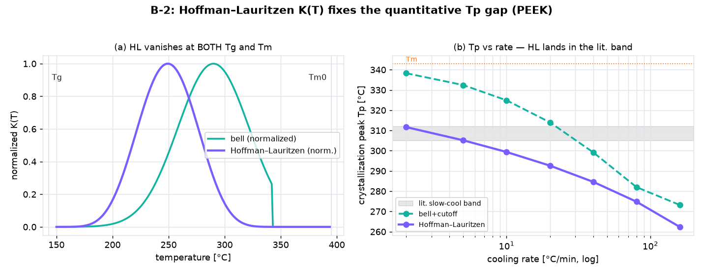

# B-1 · Method validation on public carbon/PEEK data

The Daikin fluoropolymer-CF system is proprietary, so we validate the **method**
(the crystallization model in `../abaqus/cfrtp_cryst_umat_ve.f`) against the
**documented non-isothermal crystallization behaviour of carbon/PEEK**, for which
public data exist.

```
python3 validation/cfrtp_peek_validation.py   # prints PASS/FAIL + writes the figure
```

## What it checks (universal, documented laws)

Running the same Nakamura law as the UMAT in **physical time** over a sweep of
cooling rates (2–160 °C/min):

| check | law | bell + cutoff | Hoffman–Lauritzen |
|---|---|---|---|
| **V1** | crystallization peak Tp **decreases** with cooling rate | ✅ PASS (338 → 273 °C) | ✅ PASS (312 → 262 °C) |
| **V2** | α(T) **shifts to lower T** with faster cooling (via T_half) | ❌ **FAIL** — α never reaches 0.5 above 80 °C/min | ✅ PASS (313 → 263 °C) |
| **V3** | final crystallinity **non-increasing** | ✅ PASS (1.0 → 0.27 at 160 °C/min) | ✅ PASS — but **vacuously**: α_f = 1.000 at every DSC rate |
| **quant** | slow-cool Tp in the literature band ~305–312 °C | ❌ 332 °C, out of band | ✅ 305 °C, in band |
| **quench** | α_f collapses at the rate PEEK actually quenches amorphous (order 10³ °C/min) | ❌ ~160 °C/min — already half-suppressed at a routine DSC rate | ✅ ~640 °C/min, right order |

> ⚠️ **Corrected 2026-08-25.** This table previously recorded "V2 ✅ PASS" for a check
> that `checks()` never computed — only V1 and V3 were ever returned. V2 is implemented
> now, and it is **not** redundant: it fails the bell model.
>
> Two further honesty notes from that pass:
> - **V3 is vacuous on the DSC rates for HL** (α_f = 1.000 throughout), so "non-increasing"
>   passes while discriminating nothing. Real suppression needs quench rates, which is why
>   the separate high-rate sweep (`QUENCH_RATES`) now carries that test.
> - That quench sweep became a **third independent discriminator**, agreeing with the Tp
>   band: HL loses crystallinity at the right order of magnitude, the bell model an order
>   too early. The literature anchor here is only order-of-magnitude, so it is a weaker
>   check than the Tp band — like `LIT_TP_BAND`, still to be pinned to a specific paper.



## Finding (why this matters)

The bare bell `K(T) = KMAX·exp(−((T−TCRYST)/WCRYST)²)` used in the UMAT/deck has a
**high-T tail that does not vanish near the melt**: at slow cooling it let PEEK
"crystallize" **above Tm (343 °C)** — unphysical (nucleation needs undercooling).
This harness adds an **undercooling cutoff** (`K = 0 for T ≥ Tm`), after which Tp
stays below Tm and the trends come out right.

**Status (physics deepening):**
1. ✅ **Done** — the `Tm` undercooling cutoff is in `cfrtp_cryst_umat_ve.f`
   (`TMELT` = PROPS(31), `CONSTANTS=31`; `K=0` for `T ≥ Tm`).
2. ✅ **Done** — **Hoffman–Lauritzen** `K(T)` implemented in `cfrtp_cryst_umat_hl.f`
   (transport × nucleation, vanishing at **both** Tg and Tm0). The script now runs
   **bell+cutoff vs HL** side by side: the bell predicts slow-cool Tp ~332 °C (**out**
   of the literature ~305–312 °C band), HL predicts **~305 °C (in band)** with the
   intrinsic `K(T)` peak at ~249 °C (PEEK's isothermal optimum). Physical-time deck:
   `abaqus/cfrtp_cryst_peek_hl.inp` (10 °C/min real cooling; `K0` in 1/s, `τ_k` in s).
   **Both UMATs need a re-verify run on the Abaqus box** (new Fortran).

HL parameters (PEEK, literature-typical; confirm/refine with digitized DSC):
`n=2.5, K0=1e6 /s, U*/R=755 K, Kg=7.0e5 K², Tm0=395 °C, T∞=Tg−30`.

## Quantitative comparison hook

Drop a digitized reference `validation/peek_reference_Tp.csv` with a header
`rate_C_per_min,Tp_C` (from a paper's DSC figure) and the script auto-computes
`RMSE(Tp)` between model and literature. This is the drop-in point once a dataset
is in hand.

## Notes
- **Time units**: this runs in physical time (°C/min); the deck's `KMAX` is in the
  step's normalized time, a different unit — so the numeric `KMAX` differs by design.
- Magnitudes remain **illustrative** until DMA / measured crystallinity data.

**Refs** (see `../README.md`): Tierney & Gillespie, *Composites Part A* 35 (2004);
"Modeling of PEEK Crystallization Kinetics Under Transient Thermal Conditions,"
*Polymers* (MDPI); Nakamura et al., *J. Appl. Polym. Sci.* 16 (1972).
